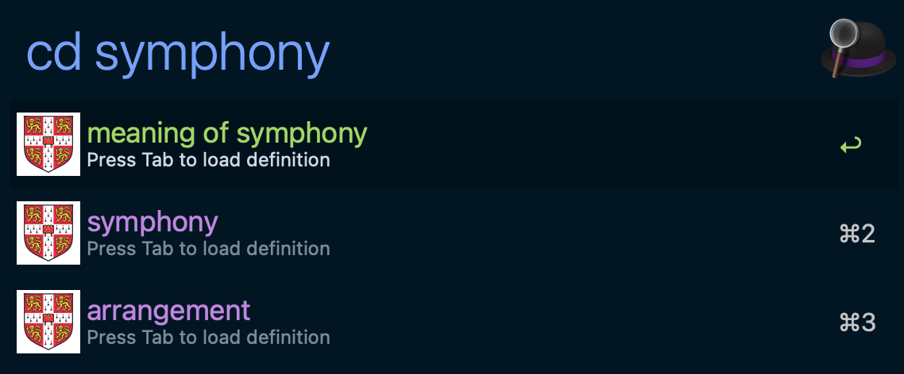

# Cambridge Dict - Alfred Workflow

Search Cambridge Dictionary from Alfred with a two-stage flow (candidate -> definition detail) and open the selected Cambridge page.

## Screenshot

## Features

- Trigger dictionary lookup with `cd <query>`.
- Candidate stage returns headwords and sets Alfred `autocomplete` tokens like `def::open`.
- Detail stage renders definitions from the selected entry.
- Press `Enter` on detail rows to open the entry URL from `arg`.
- Short query guard: `<2` characters shows `Keep typing (2+ chars)` and skips backend calls.
- Script-level guardrails: async query coalescing (final query priority) and short TTL cache reduce duplicate backend calls while typing.
- Runtime orchestration is shared via `scripts/lib/script_filter_search_driver.sh`; Cambridge-specific fetch/error mapping remains local.
- Uses `cambridge-cli` as the Alfred bridge and Playwright scraper backend.

## Configuration

Set these via Alfred's "Configure Workflow..." UI:

| Variable | Required | Default | Description |
|---|---|---|---|
| `CAMBRIDGE_DICT_MODE` | No | `english` | Dictionary mode. Allowed values: `english`, `english-chinese-traditional`. |
| `CAMBRIDGE_MAX_RESULTS` | No | `8` | Max candidate rows in suggest stage. Effective range is clamped to `1..20`. |
| `CAMBRIDGE_TIMEOUT_MS` | No | `8000` | Playwright timeout in milliseconds. Effective range is clamped to `1000..30000`. |
| `CAMBRIDGE_HEADLESS` | No | `true` | Playwright headless mode flag. Allowed values: `true`, `false`. |

## Keyword

| Keyword | Behavior |
|---|---|
| `cd <query>` | Candidate stage via `cambridge-cli query --input <query>`; selecting candidate transitions with `def::WORD` autocomplete token. |

## Advanced Runtime Parameters

| Parameter | Description |
|---|---|
| `CAMBRIDGE_CLI_BIN` | Optional absolute executable path override for `cambridge-cli`. |
| `CAMBRIDGE_SCRAPER_SCRIPT` | Exported by `script_filter.sh` to point to bundled `scripts/cambridge_scraper.mjs`. |
| `CAMBRIDGE_QUERY_CACHE_TTL_SECONDS` | Optional same-query cache TTL (seconds). Default `0` (disabled to avoid stale mid-typing hits). |
| `CAMBRIDGE_QUERY_COALESCE_SETTLE_SECONDS` | Optional coalesce settle window (seconds). Default `2`. |
| `CAMBRIDGE_QUERY_COALESCE_RERUN_SECONDS` | Optional Alfred rerun interval while waiting for coalesced result. Default `0.4`. |

## Runtime bootstrap

After installing workflow artifact into Alfred, install workflow-local Playwright runtime once:

- `scripts/setup-cambridge-workflow-runtime.sh`

## Deterministic tests (no live network by default)

- Node fixture tests: `npm run test:cambridge-scraper`
- Workflow smoke: `bash workflows/cambridge-dict/tests/smoke.sh`

Live scraping checks are intentionally not part of default smoke gates.

### Change-scoped checks

- If changes include `workflows/cambridge-dict/scripts/` or root `package.json`, run:
  - `npm run test:cambridge-scraper`
- If changes include any files under `workflows/cambridge-dict/`, run:
  - `bash workflows/cambridge-dict/tests/smoke.sh`

## Troubleshooting

See [TROUBLESHOOTING.md](./TROUBLESHOOTING.md).
