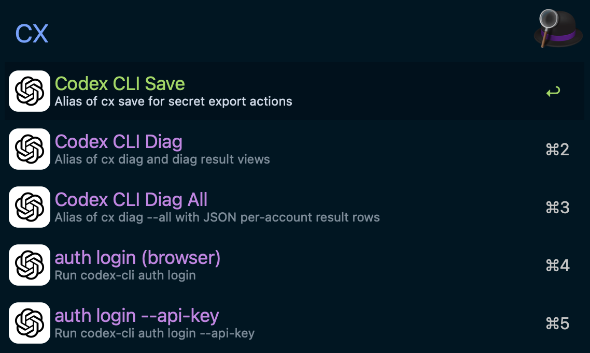

# Codex CLI - Alfred Workflow

Run core `nils-codex-cli@0.3.2` operations from Alfred.

## Screenshot



## Scope

This workflow currently supports:

- `auth login` (browser, `--api-key`, `--device-code`)
- `auth save [--yes] <secret.json>`
- `diag rate-limits` presets:
  - default
  - `--cached`
  - `--one-line`
  - `--all`
  - `--all --json` (parsed in Alfred)
  - `--all --async --jobs 4`

Diag result behavior:

- `cxd` / `cxda` menu shows latest cached diag result inline (if available).
- `cxda result` parses JSON and renders one account per row.
- `cxda result` rows are sorted by `weekly_reset_epoch` ascending (earliest reset first).
- Parsed subtitle format: `<email> | reset <weekly_reset_local> | source <source>`.

## Runtime Requirements

- End users: no extra install when using release artifact.
- `.alfredworkflow` bundles `codex-cli@0.3.2` (release-coupled runtime version).
- Bundled target: macOS `arm64`.

Fallback runtime sources (when bundled binary is unavailable):

1. `CODEX_CLI_BIN` (absolute path)
2. `PATH` lookup (`codex-cli`)

Manual fallback install:

```bash
cargo install nils-codex-cli --version 0.3.2
```

## Configuration

| Variable | Required | Default | Description |
|---|---|---|---|
| `CODEX_CLI_BIN` | No | empty | Optional absolute path override for `codex-cli`. |
| `CODEX_SECRET_DIR` | No | empty | Optional secret directory override. If empty, runtime fallback is `$XDG_CONFIG_HOME/codex_secrets` or `~/.config/codex_secrets`. |
| `CODEX_SHOW_ASSESSMENT` | No | `0` | Show assessment rows in Alfred list (`1/true/yes/on` to enable). |
| `CODEX_LOGIN_TIMEOUT_SECONDS` | No | `60` | Login timeout in seconds (`1..3600`). |
| `CODEX_API_KEY` | No | empty | API key source for `auth login --api-key` (otherwise prompt on macOS). |
| `CODEX_SAVE_CONFIRM` | No | `1` | Require confirmation for `save` without `--yes` (`0` disables). |

## Keywords

| Keyword | Behavior |
|---|---|
| `cx` | Command palette for auth/save/diag actions. |
| `cxa` | Alias of `cx auth ...`. |
| `cxd` | Alias of `cx diag ...`. |
| `cxda` | Alias of `cx diag all-json ...` (all-accounts JSON view). |
| `cxs` | Alias of `cx save ...`. |

## Query Examples

| Query | Result |
|---|---|
| `cx login` | Run `codex-cli auth login` |
| `cx login --api-key` | Run `codex-cli auth login --api-key` |
| `cx login --device-code` | Run `codex-cli auth login --device-code` |
| `cx save team-alpha.json` | Run `codex-cli auth save team-alpha.json` (with confirmation) |
| `cx save --yes team-alpha.json` | Run `codex-cli auth save --yes team-alpha.json` |
| `cxs --yes team-alpha.json` | Alias of `cx save --yes team-alpha.json` |
| `cx diag` | Run `codex-cli diag rate-limits` |
| `cx diag cached` | Run `codex-cli diag rate-limits --cached` |
| `cx diag one-line` | Run `codex-cli diag rate-limits --one-line` |
| `cx diag all` | Run `codex-cli diag rate-limits --all` |
| `cx diag async` | Run `codex-cli diag rate-limits --all --async --jobs 4` |
| `cxda` | Run `codex-cli diag rate-limits --all --json` |
| `cxd result` | Show latest cached diag result lines/rows |
| `cxda result` | Show latest cached all-json parsed rows |
| `cxda result raw` | Same as above with higher row limit |
| `cx help --assessment` | Show assessment rows + executable actions |

## Maintainer Packaging Notes

- Official package should bundle exactly `codex-cli@0.3.2`.
- `scripts/workflow-pack.sh --id codex-cli` runs `workflows/codex-cli/scripts/prepare_package.sh`.
- If auto-detection fails during packaging, set:
  - `CODEX_CLI_PACK_BIN=/absolute/path/to/codex-cli`

## Validation

Run before packaging/release:

- `bash workflows/codex-cli/tests/smoke.sh`
- `scripts/workflow-test.sh --id codex-cli`
- `scripts/workflow-pack.sh --id codex-cli`
