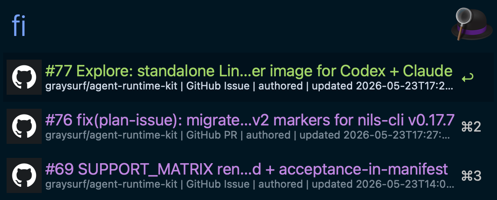

# Forge Inbox Alfred Workflow

Personal work inbox for GitHub and GitLab items returned by `forge-cli inbox`.

The workflow is intentionally provider-neutral at the Alfred layer: it calls the
external `forge-cli` runtime, parses its JSON envelope, filters rows locally,
and opens or copies item URLs.

## Screenshot



## Features

- Provider modes: GitHub only, GitLab only, or mixed GitHub + GitLab.
- Item modes: PR / MR only, issue only, or all inbox work.
- Local text filter over title, repo, number, author, provider, reason, and
  source.
- Partial provider failures render warning rows without hiding successful rows.
- GitLab host configuration is explicit so portable workflow packages do not
  hardcode private hosts.

## Usage

Keyword:

```text
fi [provider-mode] [item-mode] [text-filter]
```

Provider tokens:

| Token | Meaning |
| --- | --- |
| `all`, `both`, `mixed` | GitHub + GitLab |
| `gh`, `github` | GitHub only |
| `glab`, `gitlab` | GitLab only |

Item tokens:

| Token | Meaning |
| --- | --- |
| `all`, `work` | PR / MR, issue, and other inbox rows |
| `pr`, `prs`, `mr`, `mrs` | PR / MR rows |
| `issue`, `issues` | Issue rows |

Examples:

```text
fi
fi gh pr
fi glab issue
fi all all nils-cli
fi pr review
fi issue gamania
```

Unrecognized tokens after the leading modes are treated as the text filter.

## Actions

- Enter: open the item URL.
- Command: copy the item URL.
- Option: copy a compact Markdown reference.

The workflow is read-only. It does not mutate PRs, MRs, issues, todos, labels,
assignments, comments, or review state.

## Configuration

| Variable | Required | Default | Description |
| --- | --- | --- | --- |
| `FORGE_CLI_BIN` | No | empty | Optional absolute path to `forge-cli`. Empty uses `PATH`. |
| `FORGE_INBOX_PROVIDER_MODE` | No | `all` | Default provider mode: `all`, `gh`, or `glab`. |
| `FORGE_INBOX_ITEM_MODE` | No | `all` | Default item mode: `all`, `pr`, or `issue`. |
| `FORGE_INBOX_GITLAB_HOST` | For GitLab modes | empty | GitLab host passed as `--gitlab-host`. |
| `FORGE_INBOX_GITLAB_VPN` | No | empty | Optional GitLab VPN policy passed as `--gitlab-vpn` (`off`, `optional`, `required`). |
| `FORGE_INBOX_GITLAB_VPN_CHECK` | No | empty | Optional readiness check passed as `--gitlab-vpn-check`, for example `tcp:<host>:443`. |
| `FORGE_INBOX_GITLAB_VPN_CHECK_TIMEOUT` | No | empty | Optional readiness timeout passed as `--gitlab-vpn-check-timeout`, for example `5s`. |
| `FORGE_INBOX_GITLAB_OPENVPN_PROFILE` | No | empty | Optional local OpenVPN profile path passed to `forge-cli`; keep empty in portable packages. |
| `FORGE_INBOX_PROVIDER_TIMEOUT` | No | empty | Optional GitLab backend timeout passed as `--provider-timeout`, for example `20s`. |
| `FORGE_INBOX_STRICT_PROVIDERS` | No | `false` | Pass `--strict-providers` when true. |
| `FORGE_INBOX_CACHE_FALLBACK` | No | `false` | Pass `--cache-fallback` when true. |
| `FORGE_INBOX_CACHE_MAX_AGE` | No | empty | Optional cached fallback max age passed as `--cache-max-age`, for example `30m`. |
| `FORGE_INBOX_NO_CACHE` | No | `false` | Pass `--no-cache` when true. |
| `FORGE_INBOX_SHOW_CONFIG_WARNINGS` | No | `false` | Show non-blocking config warning rows. |
| `FORGE_INBOX_LIMIT` | No | `30` | Row limit requested from `forge-cli`, clamped to `1..100`. |

Mixed mode with an empty `FORGE_INBOX_GITLAB_HOST` falls back to GitHub-only
results. Set `FORGE_INBOX_SHOW_CONFIG_WARNINGS=true` to show a GitLab host
warning row for that fallback. GitLab-only mode with an empty host does not
invoke `forge-cli`; with `FORGE_INBOX_SHOW_CONFIG_WARNINGS=false` it returns no
rows, and with `true` it renders the same GitLab host configuration row.

## Runtime Contract

The Script Filter runs one of these command shapes:

```text
forge-cli --provider github --format json inbox list --limit <limit>
forge-cli --provider gitlab --format json inbox list --gitlab-host <host> --limit <limit>
forge-cli --format json inbox list --gitlab-host <host> --limit <limit>
```

When the GitLab VPN, timeout, strict-provider, or cache variables are set, the
workflow appends the matching `forge-cli inbox list` flags to GitLab-capable
command shapes. Empty values are omitted so portable packages keep the default
`forge-cli` behavior.

Alfred keywords:

- `fi`: default provider mode from `FORGE_INBOX_PROVIDER_MODE`.
- `fih`: GitHub-only inbox.
- `fil`: GitLab-only inbox.

PR / issue selection is a display-layer filter. The workflow never maps `pr` or
`issue` mode to `forge-cli --kind`, because `--kind` is a reason filter in the
current `forge-cli inbox` contract.

## Troubleshooting

See [TROUBLESHOOTING.md](./TROUBLESHOOTING.md).
