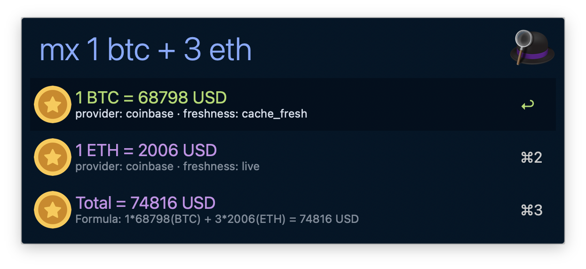

# Market Expression - Alfred Workflow

Evaluate market expressions and copy the formatted result.

## Screenshot

## Features

- Trigger with `mx <expression>`.
- Calls `market-cli expr --query <query> --default-fiat <MARKET_DEFAULT_FIAT>`.
- Supports `+ - * /` for numeric-only expressions and `+ -` for asset expressions, with target fiat syntax `to <FIAT>` (default `USD`).
- Accepts compact asset terms like `1btc` and `3eth` (auto-normalized).
- Enter on a row copies the selected payload via `pbcopy`.
- Supports local binary override via `MARKET_CLI_BIN` for debugging.
- Friendly validation messages for common expression mistakes.

## Configuration

Set these via Alfred's "Configure Workflow..." UI:

| Variable | Required | Default | Description |
|---|---|---|---|
| `MARKET_CLI_BIN` | No | (empty) | Optional absolute path override for `market-cli`. |
| `MARKET_DEFAULT_FIAT` | No | `USD` | Default fiat passed to `market-cli expr --default-fiat` when query omits fiat target. |

## Keyword

| Keyword | Behavior |
|---|---|
| `mx <expression>` | Evaluate expression and show Alfred rows from `market-cli expr`. |
| `mx` | Shows usage guidance for expression syntax. |

## Validation

- `bash workflows/market-expression/tests/smoke.sh`
- `scripts/workflow-test.sh --id market-expression`
- `scripts/workflow-pack.sh --id market-expression`

## Optional live smoke (maintainer)

- `bash scripts/market-cli-live-smoke.sh`
- This live check is optional maintainer validation for provider freshness/contract behavior.
- It is not required for commit gates or CI pass/fail.

## Troubleshooting

See [TROUBLESHOOTING.md](./TROUBLESHOOTING.md).
