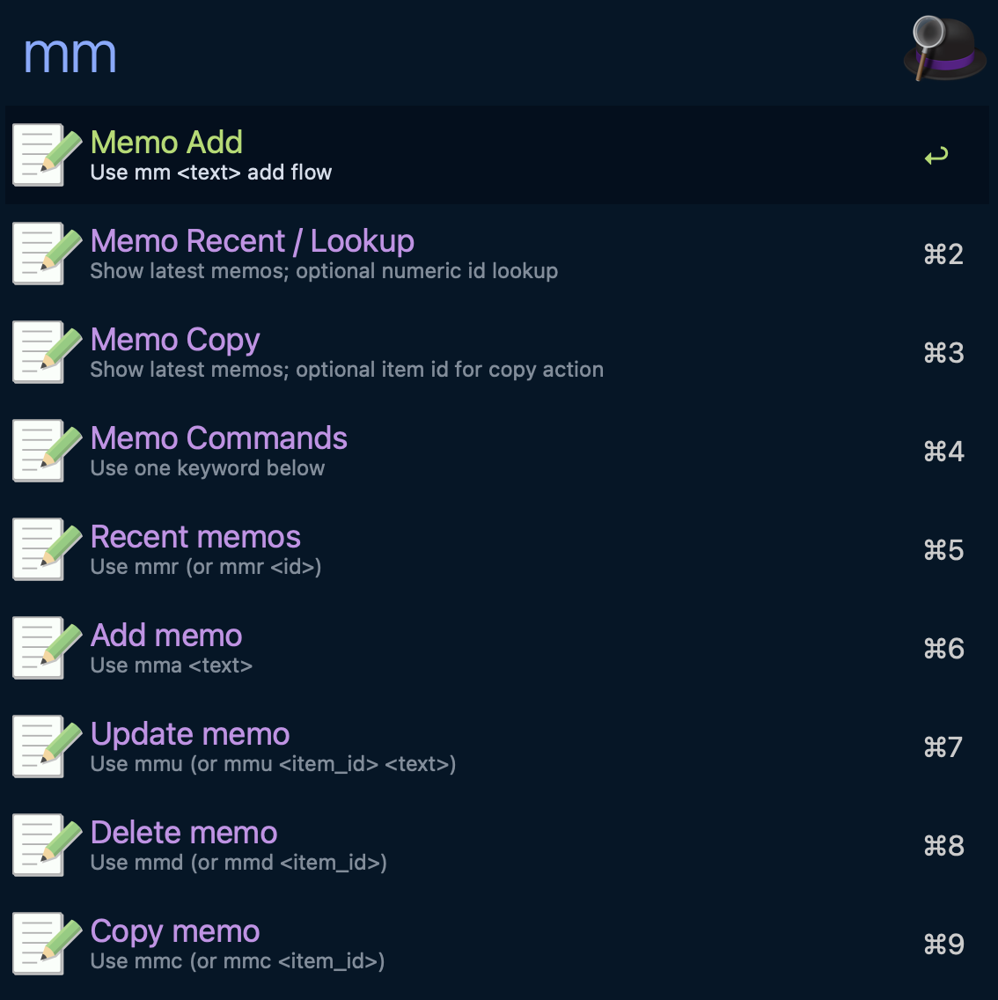

# Memo Add - Alfred Workflow

Capture memo text quickly into SQLite-backed `nils-memo-cli@0.3.7` storage.

## Screenshot



## Features

- Keyword `mm` as command entry.
- Extra keywords: `mmr` (latest rows / full item menu), `mma` (add), `mmu` (update), `mmd` (delete), `mmc` (copy), `mmq` (search).
- Primary flow supports `add`, `update`, and `delete`.
- Search flow supports `search` via dedicated `mmq` keyword and item-management routing.
- Latest-list view (`mmr`) shows `db init` only when db is missing; otherwise shows db path + latest memo rows.
- `mmr` recent rows support full action menu flow: Enter -> choose `copy` / `update` / `delete`.
- UI rows show short item refs (`#<number>`, for example `#4`) while action tokens keep canonical `itm_XXXXXXXX`.
- Delete intent is hard-delete (permanent remove, no undo).
- Runtime parameters for DB path, source label, confirmation gate, and max input bytes.

## Configuration

Set these via Alfred's `Configure Workflow...` UI:

| Variable | Required | Default | Description |
|---|---|---|---|
| `MEMO_DB_PATH` | No | `(empty)` | SQLite path override. Empty uses Alfred workflow data dir, then memo-cli default path. |
| `MEMO_SOURCE` | No | `alfred` | Source label saved with each memo item. |
| `MEMO_REQUIRE_CONFIRM` | No | `0` | `1/true/yes/on` adds an explicit confirm row before add action. |
| `MEMO_MAX_INPUT_BYTES` | No | `4096` | Max bytes allowed for one memo input. |
| `MEMO_RECENT_LIMIT` | No | `8` | Number of recent rows shown when query is empty (`1..50`). |
| `MEMO_SEARCH_MATCH` | No | `fts` | Default search match mode for `mmq`/`search` (`fts`, `prefix`, `contains`). |
| `MEMO_WORKFLOW_CLI_BIN` | No | `(empty)` | Optional executable path override for `memo-workflow-cli`. |

## Keyword

| Keyword | Behavior |
|---|---|
| `mm` | Command entry menu (Enter on row appends suffix and switches directly to `mmr` / `mma` / `mmu` / `mmd` / `mmc` / `mmq`). |
| `mmr` | Show latest memo rows (newest first); `mmr <number>` opens memo item menu by id. |
| `mma <text>` | Add intent keyword for `add::<text>`. |
| `mmu` | Show latest memo rows (same as `mmr`); `mmu <number>` routes to update flow for that id; `mmu <item_id> <text>` routes update intent. |
| `mmd` | Show latest memo rows (same as `mmr`); `mmd <number>` routes to delete action for that id; `mmd <item_id>` routes delete intent. |
| `mmc` | Show latest memo rows (same as `mmr`); `mmc <number>` or `mmc <item_id>` routes copy action for that id. |
| `mmq` | Search memos; `mmq <query>` routes to search intent (default mode from `MEMO_SEARCH_MATCH`) and always returns selectable search rows. |

## Query intents

- `mm` is entry-only and does not execute query intents directly.
- `mmr` forces empty-query rendering to show newest-first recent rows.
- `mmr <number>` routes to `item <number>` lookup flow (full menu: copy/update/delete).
- `mmu` / `mmd` also force empty-query rendering to show newest-first recent rows.
- `mmc` also forces empty-query rendering to show newest-first recent rows.
- `mmu <number>` routes to update flow for that id (no full menu).
- `mmd <number>` routes to delete action for that id (no full menu).
- `mmc <number>` routes to copy action for that id (no full menu).
- `mmq <query>` routes to `search <query>` intent.
- Item action menu intent: `item <item_id>` (typically from Enter on a recent row).
- Mutation/search intents: `update <item_id> <text>`, `delete <item_id>`, `copy <item_id>`, `search <query>`.
- Optional search mode intent: `search --match <fts|prefix|contains> <query>` (`fts` default).
- Keyword mutation shortcuts: `mmu <item_id> <text>`, `mmd <item_id>`, `mmc <item_id>`.
- `search <query>` always keeps non-actionable rows with `autocomplete: item <number>` for safe follow-up actions.
- `search` (without query text) returns a guidance row and no executable action.
- Copy actions: `copy::<item_id>` copies memo text (copy row title shows preview; overflow moves to subtitle), `copy-json::<item_id>` copies raw item JSON (via Cmd modifier on copy row).
- `update <item_id>` without text shows guidance row and keeps autocomplete for second-step typing.
- Invalid mutation syntax (for example missing `item_id` or missing update text) returns non-actionable guidance rows.

## Operator CRUD verification

```bash
tmpdir="$(mktemp -d)"
db="$tmpdir/memo.db"

add_json="$(cargo run -p nils-memo-workflow-cli -- add --db "$db" --text "before" --mode json)"
item_id="$(jq -r '.result.item_id' <<<"$add_json")"

cargo run -p nils-memo-workflow-cli -- update --db "$db" --item-id "$item_id" --text "after" --mode json \
  | jq -e '.ok == true and .result.item_id == "'"$item_id"'"'

cargo run -p nils-memo-workflow-cli -- delete --db "$db" --item-id "$item_id" --mode json \
  | jq -e '.ok == true and .result.deleted == true'

cargo run -p nils-memo-workflow-cli -- add --db "$db" --text "search target" >/dev/null
cargo run -p nils-memo-workflow-cli -- search --db "$db" --query "target" --mode json \
  | jq -e '.ok == true and (.result | length) >= 1'
```

## Validation

- `bash workflows/memo-add/tests/smoke.sh`
- `scripts/workflow-test.sh --id memo-add`
- `scripts/workflow-pack.sh --id memo-add`
