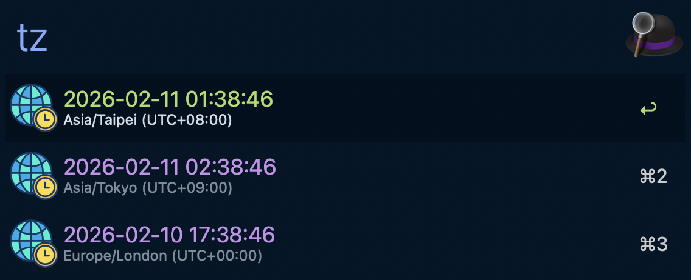

# Multi Timezone - Alfred Workflow

Show current time across one or more IANA timezones and copy a selected value.

## Screenshot

## Features

- Trigger with `tz <timezone-list>`.
- Supports comma/newline separated IANA timezone IDs (for example `Asia/Taipei,America/New_York`).
- Query input overrides configured workflow default zones.
- Empty query + empty config uses fallback chain (default `MULTI_TZ_LOCAL_OVERRIDE=Europe/London`).
- Output order is deterministic and follows input order.
- Press `Enter` on any row to copy selected payload via `pbcopy`.

## Configuration

Set these via Alfred's "Configure Workflow..." UI:

| Variable | Required | Default | Description |
|---|---|---|---|
| `TIMEZONE_CLI_BIN` | No | (empty) | Optional absolute path override for `timezone-cli` (useful for local debugging). |
| `MULTI_TZ_ZONES` | No | (empty) | Default timezone list used when query is empty. Supports comma/newline separated IANA IDs. |
| `MULTI_TZ_LOCAL_OVERRIDE` | No | `Europe/London` | Optional local timezone override in fallback mode (must be IANA timezone ID). |

## Keyword

| Keyword | Behavior |
|---|---|
| `tz <timezone-list>` | Show current time for provided IANA timezone list in the same order as input. |
| `tz` | Use `MULTI_TZ_ZONES`; if empty, fallback chain starts from `MULTI_TZ_LOCAL_OVERRIDE` (default `Europe/London`). |

## Local Timezone Fallback Chain

When no timezone list is provided, `timezone-cli` resolves local timezone in order:

1. `MULTI_TZ_LOCAL_OVERRIDE`
2. `TZ`
3. `iana_time_zone` runtime lookup
4. Platform command lookup (`systemsetup` on macOS, `timedatectl` on Linux)
5. `/etc/localtime` symlink parse
6. `UTC`

## Validation

- `bash workflows/multi-timezone/tests/smoke.sh`
- `scripts/workflow-test.sh --id multi-timezone`
- `scripts/workflow-pack.sh --id multi-timezone`
