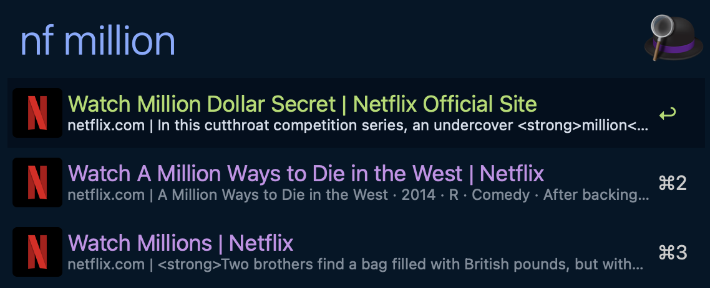

# Netflix Search - Alfred Workflow

Search Netflix title pages from Alfred via Brave Search and open selected results in your browser.

## Screenshot



## Features

- Trigger Netflix title search with `nf <query>` or `netflix <query>`.
- Netflix query scope is chosen by a country map from `NETFLIX_CATALOG_REGION` (fallback `BRAVE_COUNTRY`):
  - Mapped catalog regions -> `site:netflix.com/<country>/title`
  - `US` and other/unmapped regions -> `site:netflix.com/title`
- Runtime fallback for unsupported Brave `BRAVE_COUNTRY`:
  - If Brave returns `422 validate request parameter`, retry once without `BRAVE_COUNTRY` and keep the same Netflix site scope.
- Open selected Netflix result URL in your default browser with `Enter`.
- Short query guard: `<2` characters shows `Keep typing (2+ chars)` and skips API calls.
- Script Filter queue policy: 1 second delay with initial immediate run disabled.
- Script-level guardrails: async query coalescing (final query priority) and short TTL cache reduce duplicate API calls while typing.
- Runtime orchestration is shared via `scripts/lib/script_filter_search_driver.sh`; Netflix-specific query shaping and error mapping remain local.
- Map common failures (missing API key, rate limiting, API unavailable, invalid config) to actionable Alfred messages.

## Configuration

Set these via Alfred's "Configure Workflow..." UI:

| Variable | Required | Default | Description |
|---|---|---|---|
| `BRAVE_API_KEY` | Yes | (empty) | Brave Search API subscription token. |
| `BRAVE_MAX_RESULTS` | No | `10` | Max results per query. Effective range is clamped to `1..20`. |
| `BRAVE_SAFESEARCH` | No | `off` | Safe search mode: `strict`, `moderate`, or `off`. |
| `NETFLIX_CATALOG_REGION` | No | (empty) | Optional uppercase ISO 3166-1 alpha-2 catalog region for Netflix site scope. Fallback to `BRAVE_COUNTRY` when unset/invalid. |
| `BRAVE_COUNTRY` | No | (empty) | Optional uppercase ISO 3166-1 alpha-2 country code for Brave ranking/locale bias. |

Recommended usage:

```text
NETFLIX_CATALOG_REGION=VN  # content catalog region target
BRAVE_COUNTRY=US           # optional Brave ranking/language bias
```

Use `NETFLIX_CATALOG_REGION` as the primary content target. Keep `BRAVE_COUNTRY` optional for ranking and language bias only.

## Keyword

| Keyword | Behavior |
|---|---|
| `nf <query>` | Search Netflix title pages through Brave using mapped site scope from `NETFLIX_CATALOG_REGION` (fallback `BRAVE_COUNTRY`), then open selected URL. |
| `netflix <query>` | Same behavior as `nf <query>`. |

## Advanced Runtime Parameters

| Parameter | Description |
|---|---|
| `BRAVE_CLI_BIN` | Optional override path for `brave-cli` (useful for local debugging). |
| `BRAVE_QUERY_CACHE_TTL_SECONDS` | Optional same-query cache TTL (seconds). Default `0` (disabled to avoid stale mid-typing hits). |
| `BRAVE_QUERY_COALESCE_SETTLE_SECONDS` | Optional coalesce settle window (seconds). Default `2`. |
| `BRAVE_QUERY_COALESCE_RERUN_SECONDS` | Optional Alfred rerun interval while waiting for coalesced result. Default `0.4`. |

## Country Map Maintenance

Use manual probe workflow to refresh candidate allowlist:

```bash
scripts/netflix-country-probe.sh
```

Probe is two-stage:

- Stage 1: URL pre-check (`https://www.netflix.com/<country>/title/<id>`).
- Stage 2: Brave search probe only for countries not identified as definite `NotFound`.
- `US` is forced to global path and skips search probe.

Probe output is written to:

- `$AGENTS_HOME/out/netflix-country-probe/netflix-country-probe-<timestamp>.md`
- `$AGENTS_HOME/out/netflix-country-probe/netflix-country-allowlist-<timestamp>.txt`

After reviewing the report, apply suggested allowlist to runtime map:

```bash
scripts/netflix-country-probe.sh --apply
```

## Troubleshooting

See [TROUBLESHOOTING.md](./TROUBLESHOOTING.md).
