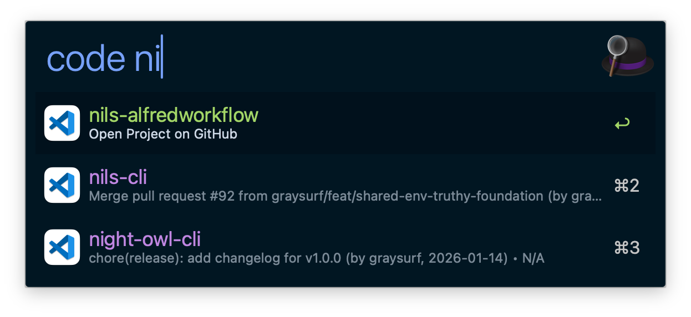

# Open Project - Alfred Workflow

Fuzzy-find local Git projects from one or more base directories, open them in your editor, and jump to GitHub remotes from Alfred.

## Screenshot

## Features

- Scan comma-separated `PROJECT_DIRS` roots (supports `~` and `$HOME`) up to depth 3.
- Search projects with `c` or `code` and rank results by recent usage.
- Show per-project metadata (latest commit summary and last opened timestamp).
- Open selected project in your editor with `Enter`.
- Open selected project on GitHub with `github <query>` or `Shift+Enter`.

## Configuration

Set these via Alfred's "Configure Workflow..." UI:

| Variable | Required | Default | Description |
|---|---|---|---|
| `PROJECT_DIRS` | No | `$HOME/Project,$HOME/.config` | Comma-separated base directories to scan for Git repositories. |
| `OPEN_PROJECT_MAX_RESULTS` | No | `30` | Maximum rows shown per query. Parsed as base-10 integer and clamped to `1..200`. |
| `USAGE_FILE` | No | `$HOME/.config/zsh/cache/.alfred_project_usage.log` | Path to usage log used for recency sorting. |
| `VSCODE_PATH` | No | `/Applications/Visual Studio Code.app/Contents/Resources/app/bin/code` | Editor executable path or command used to open a project. |

## Keywords

| Keyword | Behavior |
|---|---|
| `c <query>` | Search and open matching project in editor. |
| `code <query>` | Same behavior as `c`. |
| `github <query>` | Search and open matching project GitHub URL. |

## Advanced Runtime Parameters

| Parameter | Description |
|---|---|
| `WORKFLOW_CLI_BIN` | Optional override path for `workflow-cli` (useful for local debugging). |

## Troubleshooting

See [TROUBLESHOOTING.md](./TROUBLESHOOTING.md).
