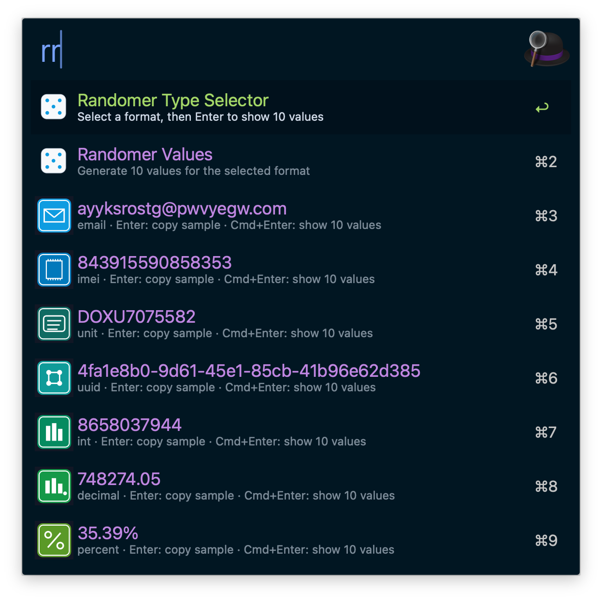

# Randomer Workflow

Generate random values by format and copy them directly from Alfred.

## Screenshot

## Keywords

- `rr`
- `rrv`

## Behavior

- `Enter` on a format item copies its sample value.
- `Cmd+Enter` on a format item opens a second result list with 10 generated values.
- `rrv <partial-type>` lets you filter type names (for example `rrv in` to pick `int`).
- `Enter` on an `rrv` type item opens the 10-value list for that type.
- `Enter` on a generated value copies that value.

## Supported Formats

| Type | Description | Example |
| --- | --- | --- |
| `email` | Random email address | `alice9k2m3p@example.com` |
| `imei` | 15-digit IMEI-like number | `490154203237518` |
| `unit` | 11-char unit code (`[A-Z]{3}[UJZ][0-9]{7}`) | `ABCU1234567` |
| `uuid` | UUID v4 string | `550e8400-e29b-41d4-a716-446655440000` |
| `int` | Digits-only integer | `736492` |
| `phone` | Taiwan mobile number (`09` + 8 digits) | `0912345678` |
| `decimal` | Fixed 2-decimal number | `128.45` |
| `percent` | Percentage with `%` suffix | `73.20%` |
| `currency` | USD-style value with separators | `$12,345.67` |
| `hex` | 8-digit uppercase hexadecimal | `0x7FA3C21B` |
| `otp` | 6-digit zero-padded code | `042931` |
