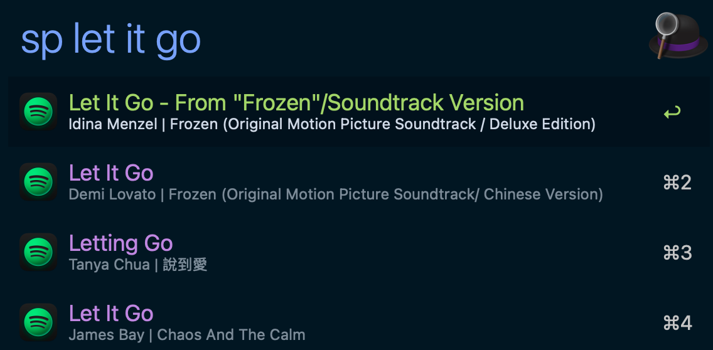

# Spotify Search - Alfred Workflow

Search Spotify tracks from Alfred and play selected results in Spotify app.

## Screenshot

## Features

- Trigger Spotify search with `sp <query>`.
- Includes an unassigned hotkey trigger that users can bind in Alfred.
- Show track title and artist summary directly in Alfred.
- Open selected result in Spotify app with `Enter`.
- Map common failures (missing credentials, rate limit, API unavailable, invalid config) to actionable Alfred messages.
- Tune result count and market targeting through workflow variables.

## Configuration

Set these via Alfred's "Configure Workflow..." UI:

| Variable | Required | Default | Description |
|---|---|---|---|
| `SPOTIFY_CLIENT_ID` | Yes | (empty) | Spotify application client ID for Client Credentials flow. |
| `SPOTIFY_CLIENT_SECRET` | Yes | (empty) | Spotify application client secret for Client Credentials flow. |
| `SPOTIFY_MAX_RESULTS` | No | `10` | Max results per query. Effective range is clamped by CLI. |
| `SPOTIFY_MARKET` | No | (empty) | Optional uppercase ISO 3166-1 alpha-2 market code (for example `US`, `TW`, `JP`). |

## Keyword

| Keyword | Behavior |
|---|---|
| `sp <query>` | Search and list Spotify track results, then open selected result in Spotify app. |

## Hotkey (Optional)

- A hotkey trigger is included but ships unassigned by default.
- Set it from Alfred Workflow canvas: click the Hotkey node, then record your preferred key combo.

## Advanced Runtime Parameters

| Parameter | Description |
|---|---|
| `SPOTIFY_CLI_BIN` | Optional override path for `spotify-cli` (useful for local debugging). |

## Troubleshooting

See [TROUBLESHOOTING.md](./TROUBLESHOOTING.md).
