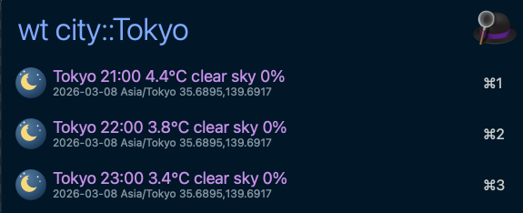

# Weather Forecast - Alfred Workflow

Show weather forecasts from `weather-cli` with separate keywords for today and week views.

## Screenshot

## Keywords

| Keyword | Behavior |
| --- | --- |
| `wt` | Show today's forecast. |
| `ww` | Pick city, then show 7-day forecast. |

## Query Format

- City name: `wt Taipei`
- Multi-city by comma: `wt Tokyo,Osaka,Taipei`
- Coordinates: `wt 25.03,121.56`
- Week view is two-stage:
  1. `ww <query>` to pick a city.
  2. Select a city row to show fixed 7-day forecast rows.
- Empty query uses `WEATHER_DEFAULT_CITIES`.

## Workflow Variables

Set these via Alfred's `Configure Workflow...` UI:

| Variable | Required | Default | Description |
| --- | --- | --- | --- |
| `WEATHER_CLI_BIN` | No | `(empty)` | Optional executable path override for `weather-cli`. |
| `WEATHER_LOCALE` | No | `en` | Output locale for weather labels (`en` default, `zh` optional). |
| `WEATHER_DEFAULT_CITIES` | No | `Tokyo` | Default city list when query is empty (comma-separated). |

## Notes

- Result row format: `City min~max°C Summary x%` (single-line title).
- Subtitle shows `Date Timezone Latitude,Longitude`.
- Result rows map weather type to icon under `assets/icons/weather/*.png` (shared visual style).
- `wt` returns all normalized rows, so Alfred can scroll through long lists.
- `ww` uses city-picker stage first, then returns fixed 7-day rows for the selected city.
- Enter on result rows copies the selected row argument.
- The workflow calls `weather-cli` with `--output alfred-json --lang <locale>`.

## Local Validation

- `bash workflows/weather/tests/smoke.sh`
- `scripts/workflow-test.sh --id weather`
- `scripts/workflow-pack.sh --id weather`
