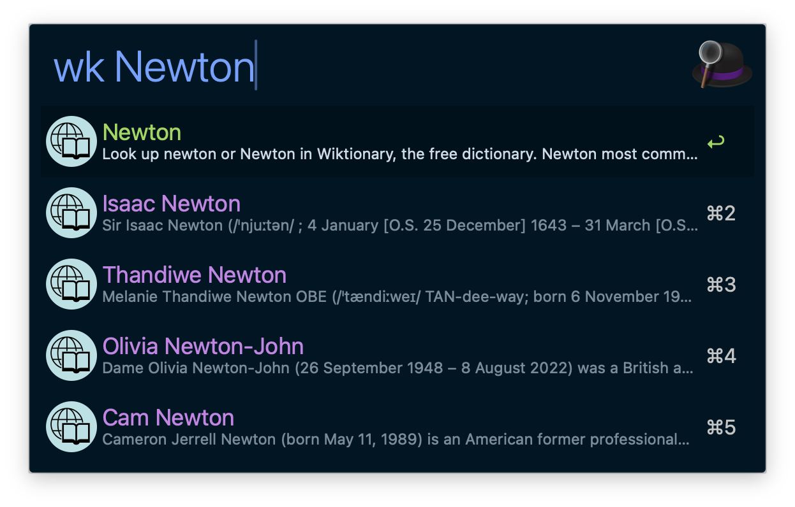

# Wiki Search - Alfred Workflow

Search Wikipedia articles from Alfred and open selected pages in your browser.

## Screenshot

## Features

- Trigger wiki search with `wk <query>`.
- Show article title and cleaned snippet directly in Alfred.
- Open selected Wikipedia article URL in your default browser with `Enter`.
- Short query guard: `<2` characters shows `Keep typing (2+ chars)` and skips API calls.
- Script Filter queue policy: 1 second delay with initial immediate run disabled.
- Script-level guardrails: async query coalescing (final query priority) and short TTL cache reduce duplicate API calls while typing.
- Map common failures (invalid config, API unavailable) to actionable Alfred messages.
- Tune language and result count through workflow variables.

## Configuration

Set these via Alfred's "Configure Workflow..." UI:

| Variable | Required | Default | Description |
|---|---|---|---|
| `WIKI_LANGUAGE` | No | `en` | Optional lowercase Wikipedia language code. Effective format is clamped to `^[a-z]{2,12}$`. |
| `WIKI_MAX_RESULTS` | No | `10` | Max results per query. Effective range is clamped to `1..20`. |

## Keyword

| Keyword | Behavior |
|---|---|
| `wk <query>` | Search and list Wikipedia articles, then open selected URL. |

## Advanced Runtime Parameters

| Parameter | Description |
|---|---|
| `WIKI_CLI_BIN` | Optional override path for `wiki-cli` (useful for local debugging). |
| `WIKI_QUERY_CACHE_TTL_SECONDS` | Optional same-query cache TTL (seconds). Default `10`. |
| `WIKI_QUERY_COALESCE_SETTLE_SECONDS` | Optional coalesce settle window (seconds). Default `2`. |
| `WIKI_QUERY_COALESCE_RERUN_SECONDS` | Optional Alfred rerun interval while waiting for coalesced result. Default `0.4`. |
